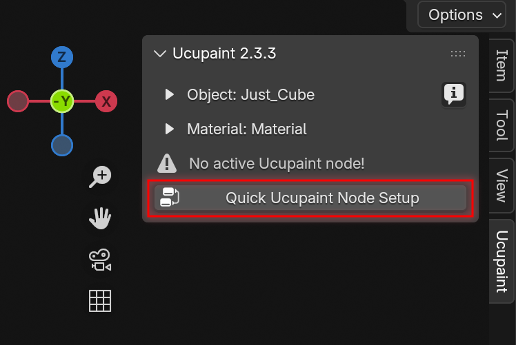
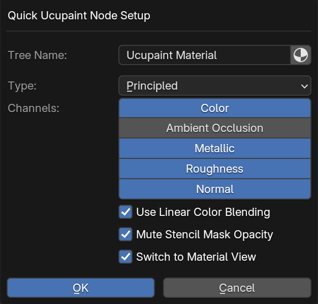
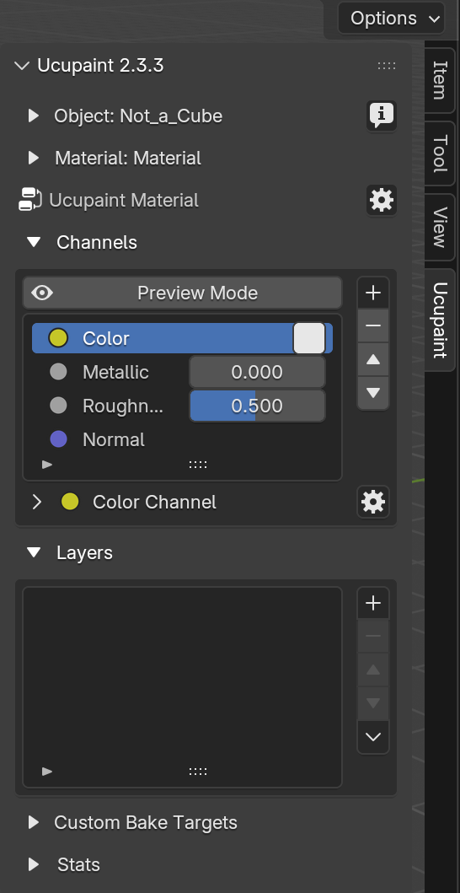
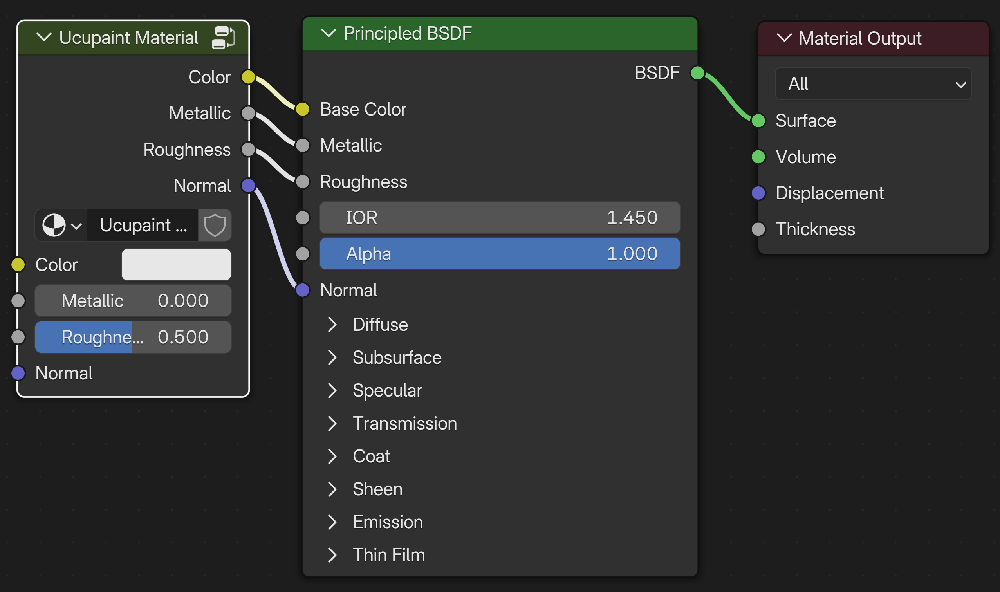
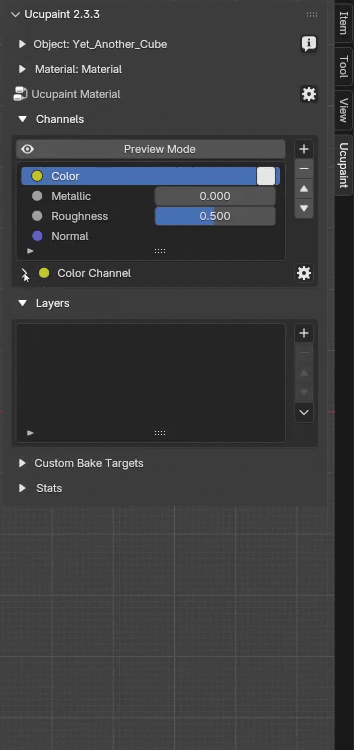

# Ucupaint Setup
## Before Setting Up Ucupaint
Assuming you've already installed the addon. The Ucupaint tab will appear in the N-panel when an object is selected.
Before you continue, make sure to check the following:

- **Make sure you are in Material Preview mode**
- **Make sure your object has been properly unwrapped**
- Even though this addon supports more than just mesh objects, **some features, such as baking operations, will only work with mesh objects**.

## Creating The Ucupaint Node
**Ucupaint is a node group.** You can create a new Ucupaint node directly in the Shader Editor.

||
|:--:|
|Creating new Ucupaint node in the Shader Editor| {align=center}

In the Shader Editor, press Shift + A, go to Group, and select Ucupaint to add the node to your material. When adding a Ucupaint node in the Shader Editor, it will start with a single channel: Color.
You can connect the Color output to any other node in your shader as needed. More details about channels are explained in [channel page](../01.01.channel/).

## Quick Setup

You can also quickly set up the Ucupaint node in the 3D viewport by clicking the **"Quick Ucupaint Node Setup"** button.

||
|:--:|
|Quick setup button| {align=center}

A pop-up menu will appear, giving you a few options for setting up the node. You can choose different shader types and add various channels.
  
||
|:--:|
|Quick setup options| {align=center}

Here are the options available in the Quick Setup menu:

- **Tree Name**: The name of the Ucupaint node group (tree). Toggle the icon on the right to set the material name as the Ucupaint tree name.
- **Type**: The BSDF shader type that the Ucupaint node will connect to.
- **Channels**: The default set of channels included in the node (additional channels can be added later).
- **Use Linear Color Blending**: Enables linear blending between layers. *This is more color-accurate but behaves differently than traditional 2D software like Photoshop.*
- **Mute Stencil mask Opacity**: Disables the default texture paint overlay, allowing visibility of other layers in Material View.
- **Switch to Material View**: Automatically changes the viewport shading to Material View after setup.

The **OK** button completes the setup process. Ucupaint is now ready to use, and the channels, along with the layer list, will be visible.

||
|:--:|
|Ucupaint is now ready to use!| {align=center}

If you open the shader editor, the quick setup creates a group node connected to the default shader (Principled BSDF), based on the channels you selected earlier. **Avoid editing the contents of this group node manually, as it may cause critical errors.**

||
|:--:|
|What quick setup actually creates| {align=center}

## Linking Ucupaint Node Tree
If you already have a node tree in the shader editor, the Ucupaint node will be placed between your existing nodes and the shader. It will automatically connect the existing channels through the Ucupaint node, **keeping your current setup intact and working as before.**

See the video below for a demonstration.

||
|:--:|
|Linking Ucupaint Node Tree with Existing Node setup| {align=center}

## Expand/Collapse Menu

Ucupaint’s UI may look simple at first, but it offers more options hidden within **collapsible menus.** Whenever you see a small triangle or arrow next to a section, it indicates that more settings can be expanded. You can see this behavior in the example GIF below.

||
|:--:|
|Expand and collapse additional options menus| {align=center}

