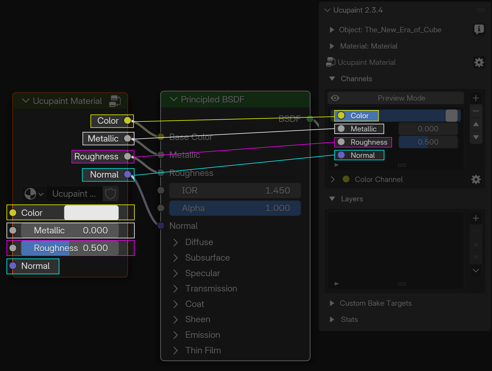
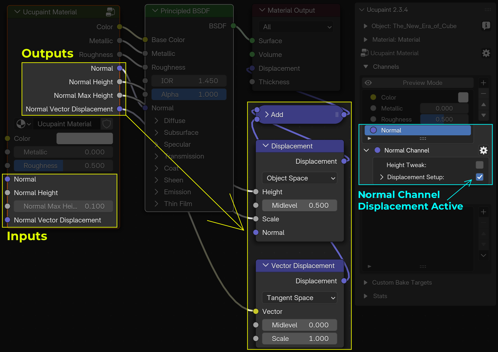

# Channels

## Channel in Ucupaint

A channel in Ucupaint represents a pair consisting of an input and an output within the Ucupaint node. 

||
|:--:|
|The Ucupaint channels input and output (I/O) connections on the actual node| {align=center}

Each channel has at least one input and one output, but some channels, like the Normal channel, can have multiple outputs.

||
|:--:|
|Multiple Normal Vector Displacement Outputs when Displacement Setup is active| {align=center}

The base color or value of the channel is the default input of the node, as shown in the GIF below.

||
|:--:|
|The base color or value of a channel corresponds to the node’s default input| {align=center}

All inputs and outputs can be freely connected, allowing the Ucupaint node to work with your custom node setups.
 
 
In the channels list panel, you can perform basic actions such as adding, moving up/down, or removing channels.

||
|:--:|
|Channels list panel| {align=center}

**!!! NOTE**
    *You may need to learn how to create a layer before continuing on this page. Click [here](../01.02.layer/#creating-new-layer-quick-guide) to jump to the Layer page*

## Adding a New Channel

To add a new channel, use the '+' button next to the channel list. The video below demonstrates how to create an Emission channel in Ucupaint.

<!-- TEMP OLD TEXT: You can create new channel by using the + button on the right of the chanels list, it will gives you channel type options, which are RGB, Value, and Normal.
For demonstration, let's try to create new channel that connect to emission socket on the principled bsdf.
Now the popup appears, if you already decided to connect it to principled bsdf, you don't have to manually name the channel, just choose emission on the dropdown, it will automatically set the name of your channel, and if you click ok, it will also connect the sockets. -->

||
|:--:|
|Adding a new channel| {align=center, width=100%}

After creating a new channel, the Ucupaint node will display new input and output sockets corresponding to that channel.

## Channel Types
There are three channel types in Ucupaint: RGB, Value, and Normal.

### RGB Channel Type
An RGB channel consists of three color values: red, green, and blue. You can also enable alpha to add transparency, which makes the base color transparent by default..

||
|:--:|
|RGB channel options| {align=center}

If alpha is enabled, your material will automatically switch to Alpha Blend mode in Eevee. The default alpha value is 0.0, making the background fully transparent.
If you create a layer with a mix blend, it will be placed on top of the transparent background. This can be useful for cases like creating hair planes or vegetation.

||
|:--:|
|Using alpha on color channel| {align=center}

### Value Channel Type
Value channels consist of a single value.

||
|:--:|
|Value channel options| {align=center}

### Normal Channel Type
Normal channels consist of a normal vector. You can have only one normal channel per Ucupaint node.

||
|:--:|
|Normal channel options| {align=center}

#### Displacement Setup
Enabling **Displacement Setup** will:

- Add a Subdivision Surface modifier to all objects using the same material
- Add a displacement node setup to the active material

By enabling this, all bump maps used in the layers will produce actual bump geometry, except for layers where **Write Height** is enabled in the layer’s channel settings.
<!-- Need more explanation -->

||
|:--:|
|Using Displacement| {align=center}

## Experimental Features

#### Smoother Bump
Smooth bump can make your bump map smoother than the Blender default at the cost of precision.

||
|:--:|
|Smooth Bump comparison| {align=center}

#### Parallax (Experimental)
Parallax is for creating parallax effects if you're using bump map. I suggest you save your file first before activating this option since it can freeze Blender. Please note that parallax only works in perspective view. Parallax is only available if you enable experimental features in Ucupaint User Preferences.

||
|:--:|
|Parallax comparison| {align=center}
