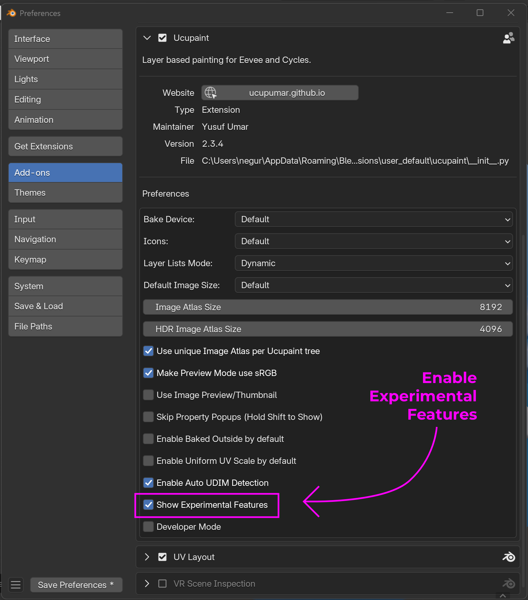

# Channels

## Channel in Ucupaint

A channel in Ucupaint represents a pair consisting of an input and an output within the Ucupaint node. 

||
|:--:|
|The Ucupaint channels input and output (I/O) connections on the actual node| {align=center}

Each channel has at least one input and one output, but some channels, like the Normal channel, can have multiple inputs and outputs.

As shown in the image below, enabling the Displacement Setup will add new input and output sockets to the Ucupaint node: Height, Max Height, and Vector Displacement.
These outputs are connected to displacement nodes, automatically created by the Displacement Setup. While you can connect them to other nodes if needed, they are mainly intended to be used with displacement nodes.

||
|:--:|
|Multiple Normal Inputs and Outputs when Displacement Setup is active| {align=center}

The base color or value of the channel is the default input of the node, as shown in the GIF below.

||
|:--:|
|The base color or value of a channel corresponds to the node’s default input| {align=center}

All inputs and outputs can be freely connected, allowing the Ucupaint node to work with your custom node setups.
 
 
In the channels list panel, you can perform basic actions such as adding, moving up/down, or removing channels.

||
|:--:|
|Channels list panel| {align=center}

**!!! NOTE**
    *You may need to learn how to create a layer before continuing on this page. Click [here](../01.02.layer/#creating-new-layer-quick-guide) to jump to the Layer page*

## Adding a New Channel

To add a new channel, use the '+' button next to the channel list. The video below demonstrates how to create an Emission channel in Ucupaint.

<!-- TEMP OLD TEXT: You can create new channel by using the + button on the right of the chanels list, it will gives you channel type options, which are RGB, Value, and Normal.
For demonstration, let's try to create new channel that connect to emission socket on the principled bsdf.
Now the popup appears, if you already decided to connect it to principled bsdf, you don't have to manually name the channel, just choose emission on the dropdown, it will automatically set the name of your channel, and if you click ok, it will also connect the sockets. -->

||
|:--:|
|Adding a new channel| {align=center, width=100%}

After creating a new channel, the Ucupaint node will display new input and output sockets corresponding to that channel.

## Channel Types
There are three channel types in Ucupaint: RGB, Value, and Normal.

### RGB Channel Type
An RGB channel consists of three color values: red, green, and blue. You can also enable alpha to add transparency, which makes the base color transparent by default..

||
|:--:|
|RGB channel options| {align=center}

If alpha is enabled, your material will automatically switch to Alpha Blend mode in Eevee. The default alpha value is 0.0, making the background fully transparent.
If you create a layer with a mix blend, it will be placed on top of the transparent background. This can be useful for cases like creating hair planes or vegetation.

||
|:--:|
|Using alpha on color channel| {align=center}

### Value Channel Type
Value channels consist of a single value.

||
|:--:|
|Value channel options| {align=center}

### Normal Channel Type
Normal channels consist of a normal vector. You can have only one normal channel per Ucupaint node.

||
|:--:|
|Normal channel options| {align=center}

#### Displacement Setup
**Enabling Displacement Setup does the following:**

- Adds a Subdivision Surface modifier to all objects using the same material
- Adds a displacement node setup to the active material
- Converts bump maps from Ucupaint layers into real geometry (unless Write Height is enabled on that layer, which disables displacement for it)

The **Max Polygons** value controls how much the object is subdivided. It’s measured in thousands; for example, a value of 1000 means up to 1 million polygons.

If you enable **Adaptive Subdivision** (Cycles only), Ucupaint will:

- Set the render engine to Cycles
- Enable the Experimental feature set
- Automatically configure adaptive subdivision, which adjusts detail based on the camera view

Adaptive subdivision improves detail where it's needed most, but may increase load time when entering render view.
<!-- Need more explanation -->

The video below demonstrates how to set up Ucupaint for drawing with displacement

||
|:--:|
|Drawing with Displacement| {align=center}

## Experimental Features

To access **Experimental Features**, go to: Edit → Preferences → Add-ons → Ucupaint, then enable the Show Experimental Features option in the Ucupaint settings.

||
|:--:|
|Enable Experimental Features| {align=center}

#### Smoother Bump
Smooth Bump makes your bump map appear smoother than Blender’s default, but this comes at the cost of some precision.

||
|:--:|
|Smooth Bump comparison| {align=center}

#### Parallax (Experimental)
The Parallax option lets you create parallax effects when using bump maps. Please save your file before enabling it, as it may cause Blender to freeze.
Note that parallax effects only work in perspective view and are only available if Experimental Features are enabled in the Ucupaint User Preferences.

||
|:--:|
|Parallax comparison| {align=center}
