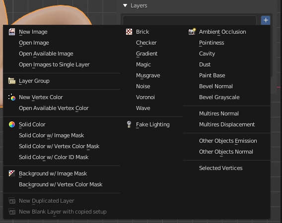

# Layer

You can access layers in the layers panel.

||
|:--:|
|Layers list panel| {align=center}

## Creating New Layer (Quick Guide)

You can create new layers by pressing the '+' button, there are various layer types that can help you finish your texturing process.

||
|:--:|
|New layer options| {align=center}

Let's try to use the "image" type. With this layer type, we can draw textures like usual. FYI, **All images generated by Ucupaint will automatically be packed when you save your blend file.**
You'll be given these options.

||
|:--:|
|New image layer dialog box| {align=center}

Those options are mostly obvious except for image atlas, more details about image atlas can be found [here](#image-atlas).
Once you're happy with the settings, just click ok. Now you have one image layer available to paint on.

||
|:--:|
|Painting on an image layer| {align=center}

The layers feature works like a layer in any other image editing software. So if we create another layer and draw over it, it will cover the layer below.

||
|:--:|
|Multiple image layers| {align=center}

!!! note
    Next Quick Guide is about how layers and channels are related, click [here](../01.03.layer-channel/#setting-up-layer-channel-quick-guide) to continue

## Layer Types

There are several layer types that can be used in Ucupaint:

### Image

You can create a new image or open an image as a layer.

#### Image Atlas

When your create new image using Ucupaint, it will give you the option to use an image atlas.

||
|:--:|
|Image atlas checkbox on new image layer options| {align=center}

If you turn on Image Atlas, the newly created layer will use portion of a larger image. Since Blender materials have limited number of images that can be used in a material (8-16 depending on your system), image atlas will use a special image that can be used as several layers or masks at the same time. This system works automatically, so you don't have to worry about it.

### Vertex Color

Vertex color can be used as a layer. There's also special vertex color editor in edit mode.

||
|:--:|
|Vertex color editor on edit mode| {align=center}

### Solid Color

Solid Color layer contains only single color, can be useful if you want to paint the mask first then edit the solid color later.

||
|:--:|
|Solid color layer| {align=center}

### Background

Backgound will use your base color & alpha settings as layer, it can be useful to create holes on the surface.

### Fake Lighting

Fake lighting will calculate fake lighting based on a given vector and matrix. If you're using camera space, it can be used for fresnel effect. Be aware if you're using camera space, the baked channel will be static.

### Group

Group layer can combine several layers into one layer and add a mask or a modifier on top of it. This can be really slow if you're using many layers and channels at the same time.

### Blender Generated Textures

You can use Blender's generated textures as a layer, for example Noise, Magic, Brick, Voronoi, etc.

### Baked Images

You can use a baked texture as a layer, for example AO, Cavity, Bevel. Be aware that the baking process may take a while to finish depending on your system and settings.

## Layer Parameters And Options

### Layer Vector

By default, a layer will use a UVMap as vector input, but you can change it to another vector type like Generated.

|![[pic: vector options]](source/03.layer.09.png)|
|:--:|
|Types of layer vector| {align=center}

Be aware that if you're using a dynamic vector like camera or window, the baked channel textures will still be static.

### Transformation Vector

You can transform your vector using this UI.

|![[gif: offset/rotate/scale image/generated layer]](source/03.layer.10.gif)|
|:--:|
|Vector transformation options| {align=center}

Be aware you can't transform image atlas layer in this way since it shares image with other layers/masks.

### Change layer type

You can change the layer type to a different one and retain it's mask and modifier settings. Use this button to change the layer type.

|![[pic: change layer type button]](source/03.layer.11.png)|
|:--:|
|Change layer type options| {align=center}

