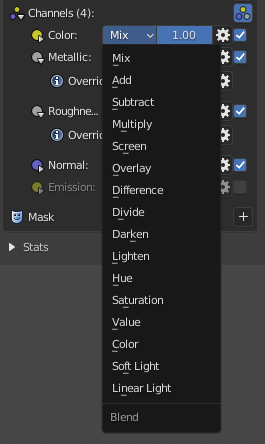
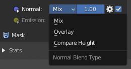

# Layer Channel

The layer channel is a bridge between layers and channels. One layer can affect multiple channels, and you can choose which channel your layer will affect.

## Setting up layer channel (Quick Guide)

By default, you can only see enabled channels, which is color the channel by default. You can show other available channels using the button below.

||
|:--:|
|Show all channels toggle| {align=center}

Now, let's try to add a metal effect to one of the layers. The metal effect can be achieved by adjusting the value of the metallic and roughness channels. First, you can set the metallic and roughness as active on the layer channel panel.

||
|:--:|
|Enabling metallic and roughness in layer channels| {align=center}

By doing this, the value of the layer will affect both metallic and roughness at the same time, which probably isn't ideal, since metallic value usually sits either on 0.0 or 1.0, and a painted layer is not exactly white.
To resolve this, you can enable override of the layer channel. Override will replace the channel value on the painted area.

||
|:--:|
|Using layer channel override| {align=center}

## Using layer's normal channel

Now let's try to use a layer's normal channel, if you enable it, it will use the layer as bump map by default, as shown below.

||
|:--:|
|Enabling normal in layer channels and editing its height| {align=center}

!!! note
    Next Quick Guide is about mask, click [here](../01.04.mask/#setting-up-mask-quick-guide) to continue

## Layer channel blending
You can change blending of each layer channel.

||
|:--:|
|Layer channel blending options| {align=center}

For the normal channel it will have different options.

||
|:--:|
|Layer channel blending options for the Normal type are different| {align=center}

## Layer channel override

You can set a specific layer channel to be a specific value or even use another image or texture. The layer channel will still use the alpha, mask, and transformation of the main layer. This can be really useful to load PBR textures into a single layer. Below is an example of how to do it.

||
|:--:|
|Using layer channel override to load PBR textures| {align=center}

If loading textures one by one is cumbersome, there's 'Open Images into Single Layer', this operator will read selected image names to determine what channel it belongs to and then load them into a single new layer. You can see how it works in video below.

||
|:--:|
|Using Open Images to Single Layer to quickly load PBR textures| {align=center}

