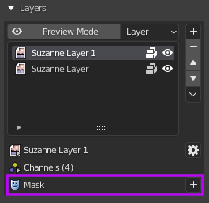

# Mask

Masks can be useful to hide or show certain part of a layer. It uses value 1.0 (white) as visible and 0.0 (black) as transparent.

## Setting up mask (Quick Guide)

You can access layer masks below the layer channels.

||
|:--:|
|Layer masks panel| {align=center}

To add a new mask just press the '+' button and you'll be given an options menu with many mask types. More details about layer mask types can be accessed [here](#mask-types).

||
|:--:|
|New layer mask options| {align=center}

Let's choose an image mask type for example, you'll be given these options:

||
|:--:|
|New image mask dialog box| {align=center}

Choose white as the base color of the mask image, now you can paint black to the mask the layer, as demonstrated below.

||
|:--:|
|Painting mask| {align=center}

You can switch between the layer image and the mask itself by clicking the icon on the layer list.

||
|:--:|
|Switching between mask and image using icons on the list| {align=center}

Or you can click this icon to enable mask editing.

||
|:--:|
|Switching between mask and image using active edit icon| {align=center}

!!! note
    Next Quick Guide is about modifiers, click [here](../01.05.modifier/#adding-modifier-quick-guide) to continue

## Mask Types

Ucupaint has several mask types that can be used, which are:

### Image

Same as it's layer counterpart. You can also use [images](../01.02.layer/#image) as a mask.

### Vertex Color

Same as it's layer counterpart. You can also use [vertex colors](../01.02.layer/#vertex-color) as a mask.

### Color ID

Color ID will use a unique random color ID that will work as a mask. It uses vertex color named '__yp_color_id' to store its color ID, when the color IDs match, then it will be valued 1.0, otherwise it will be valued 0.0. Like vertex color, Ucupaint has special editor to easily edit color IDs in edit mode.

||
|:--:|
|Using Color ID mask| {align=center}

### Object Index

Object Index will use pass index of an object as a mask.

||
|:--:|
|Using Object Index Mask| {align=center}

### Fake Lighting

Same as it's layer counterpart. You can also use [fake lighting](../01.02.layer/#fake-lighting) as a mask.

### Blender Generated Texture (Noise, Magic, Brick, Voronoi, etc)

Same as it's layer counterpart. You can also use [Blender generated textures](../01.02.layer/#blender-generated-textures) as masks.

### Baked Images

Same as it's layer counterpart. You can also use [baked images](../01.02.layer/#baked-images) as masks.

## Multiple masks on single layer

You can have more than one mask in a single layer.

||
|:--:|
|Two masks in a single image| {align=center}

To change the order of mask or do other things, you can use mask menu buttons.

||
|:--:|
|Menu for reordering masks and other things| {align=center}

## Mask options

You can change various options of each masks.

||
|:--:|
|Various options for a mask| {align=center}

Like with layers, you can edit the source, vector and blending. You can also mask only a specific channel.
