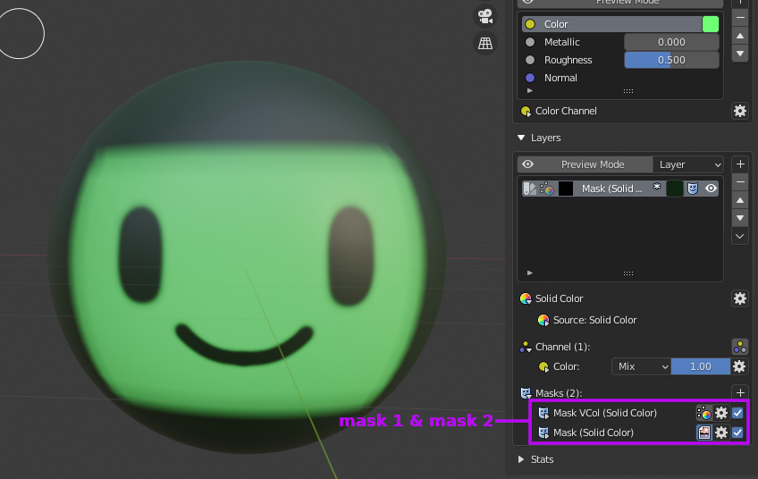
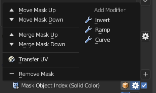

# Mask

Mask can be useful to hide or show certain part of the layer. It uses value 1.0 (white) as visible and 0.0 (black) as transparent.

## Setting up mask (Quick Guide)

You can access layer masks below the layer channels.

||
|:--:|
|Layer masks panel| {align=center}

To add new mask just press the '+' button and you'll be given option of what type mask will you use. More details about layer mask types can be accessed [here](#mask-types).

||
|:--:|
|New layer mask options| {align=center}

Let's choose image for example, you'll be given these options:

||
|:--:|
|New image mask dialog box| {align=center}

Choose white as base color of mask image, now you can paint black to mask the layer, as demonstrated below

||
|:--:|
|Painting mask| {align=center}

You can switch between the layer image and the mask itself by clicking the icon on the layer list

||
|:--:|
|Switching between mask and image using icons on the list| {align=center}

Or you can click this icon to enable edit on mask

||
|:--:|
|Switching between mask and image using active edit icon| {align=center}

!!! note
    Next Quick Guide is about modifier, click [here](../01.05.modifier/#adding-modifier-quick-guide) to continue

## Mask Types

Ucupaint has several mask types that can be used, which are:

### Image

Same as layer, you can also use [image](../01.02.layer/#image) as a mask.

### Vertex Color

Same as layer, you can also use [vertex color](../01.02.layer/#vertex-color) as a mask.

### Color ID

Color ID will use unique random color id that will works as mask. It uses vertex color named '__yp_color_id' to store it's color id, when the color id match then it will be valued 1.0, otherwise it will be valued 0.0. Like vertex color, Ucupaint has special editor to easily edit color id on edit mode.

||
|:--:|
|Using Color ID mask| {align=center}

### Object Index

Object Index will use pass index of a object as mask.

||
|:--:|
|Using Object Index Mask| {align=center}

### Fake Lighting

Like layer, you can also use [fake lighting](../01.02.layer/#fake-lighting) as a mask.

### Blender Generated Texture (Noise, Magic, Brick, Voronoi, etc)

Like layer, you can also use [Blender generated textures](../01.02.layer/#blender-generated-textures) as masks.

### Baked Images

Like layer, you can also use [baked images](../01.02.layer/#baked-images) as masks.

## Multiple masks on single layer

You can have more than one masks on a single layer.

||
|:--:|
|Two masks on single image| {align=center}

To change the order of mask or do other things, you can use mask menu button

||
|:--:|
|Menu for reordering masks and other things| {align=center}

## Mask options

You change various options of each masks

||
|:--:|
|Various options for a mask| {align=center}

Like layer, you can edit the source, vector and blending. You can also mask only specific channel
