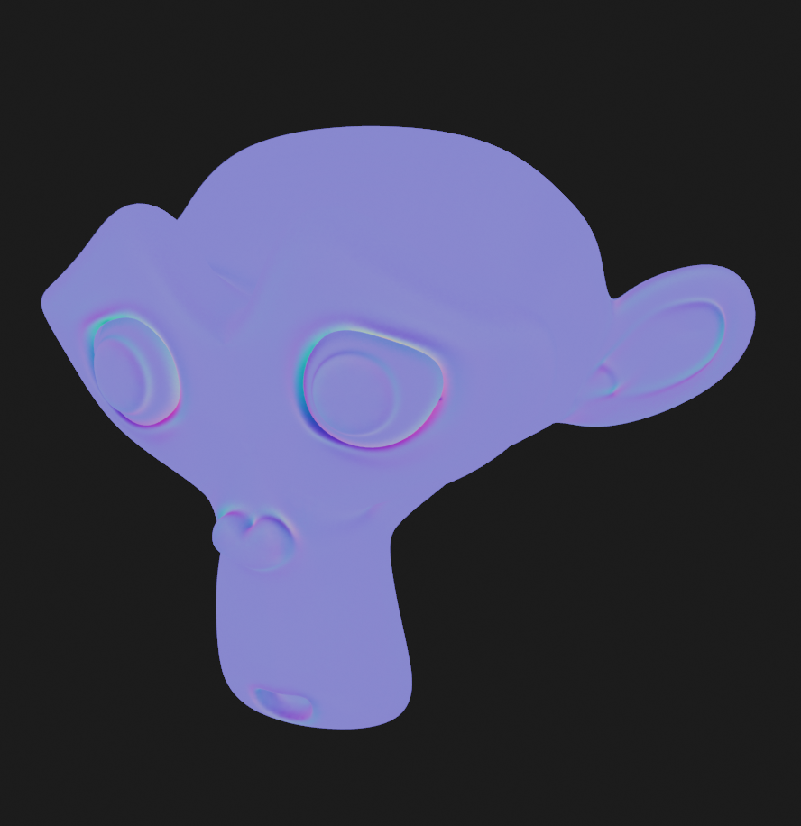
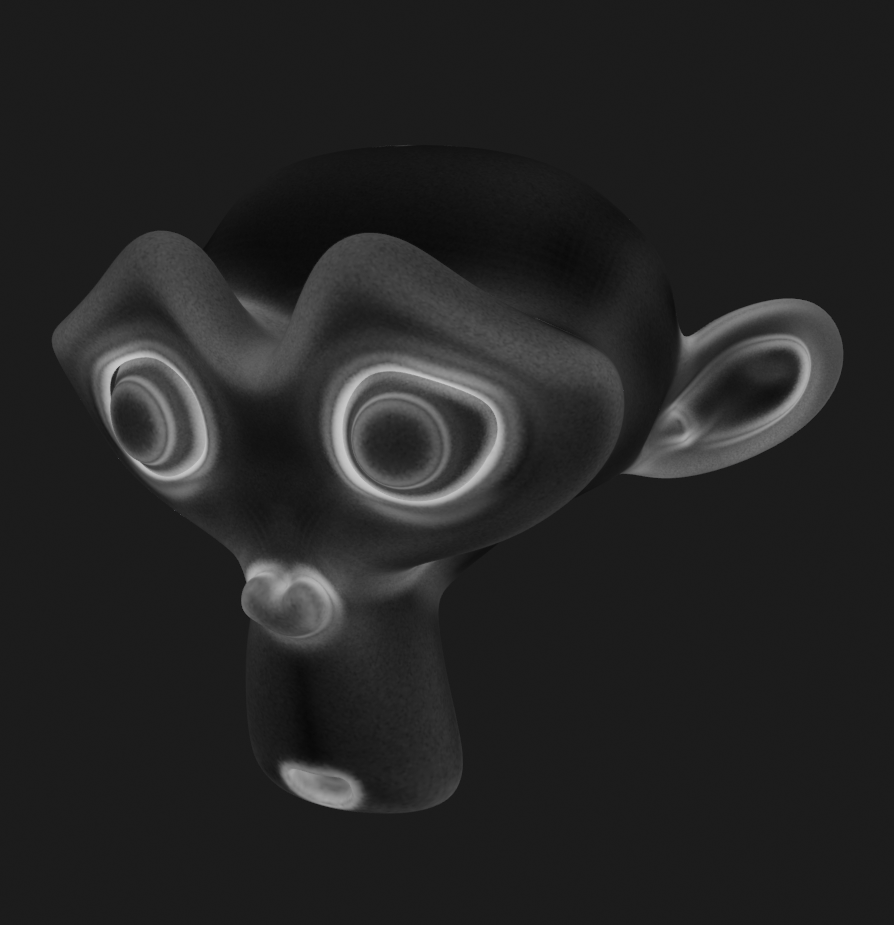

# Bake to Layer

When creating new layer, there are options to bake textures to layer. The process can take a while depending on your system. You can see how to do it on the video below.

||
|:--:|
|Bake AO to layer| {align=center}

## Rebake Layer

After you edit the mesh or the scene, sometimes you want to rebake the layer, there are two ways to do it.

### Rebake using Overwrite

If you try to add ambient occlusion layer again, it will gives you option to overwrite the currently available ambient occlusion layer. It's turned on by default so be aware of that.

||
|:--:|
|Using Overide Option| {align=center}

### Rebake using rebake button

You can also use rebake button on the layer source panel.

||
|:--:|
|Using Rebake Menu| {align=center}

## Baked Texture Types

There are several texture types that can be baked to a layer:

### AO

AO (Ambient Occlusion) can darken the valley or crease of your mesh. You can use options such as distance and local only.

||
|:--:|
|AO| {align=center}

### Pointiness

Pointiness will show you valley and ridge of your meshes. Since it need a lot of precision, by default, baking pointiness will use 32-bit float image as a target.

||
|:--:|
|Pointiness| {align=center}

### Cavity

Similar to pointiness, cavity will shows valley and ridge of your meshes but with clearer distinction, it also only use standard 8bit image by default, so it won't take a lot of space.

||
|:--:|
|Cavity| {align=center}

### Dust

Dust is similar to the cavity map but adds additional Z top normals to the mix.

||
|:--:|
|Dust| {align=center}

### Paint Base

Sometimes also referred to Blizzard or Dota diffuse map. This bake combines a dirt map with vertical gradient and top facing normals with a highlight. Credits to Danyl Bekhoucha for the shader setup.
This bake is a good starting point for character texture maps.

||
|:--:|
|Paint Base| {align=center}

### Bevel Normal

Bevel normal map in tangent space. This will bake bevel on sharp edges.

||
|:--:|
|Bevel Normal| {align=center}

### Bevel Grayscale

Grayscale bevel of the meshes.

| |
|:--:|
|Bevel Grayscale| {align=center}

### Multires Normal

This will bake the highest level of multires to normal map.

||
|:--:|
|Multiers Normal| {align=center}

### Multires Displacement

This will bake the highest level of multires to displacement/bump map.

||
|:--:|
|Multiers Displacement| {align=center}

### Other Objects Normal

This will bake the surface normal of non-active selected objects to normal map.

||
|:--:|
|Other Objects Normal| {align=center}

### Other Objects Emission

This will bake the emission color of non-active selected objects.

||
|:--:|
|Other Objects Emission| {align=center}

### Selected Vertices

This will bake the the selected vertices to white color while other vertices will be black. This can be useful for masking.

||
|:--:|
|Selected Vertices| {align=center}

