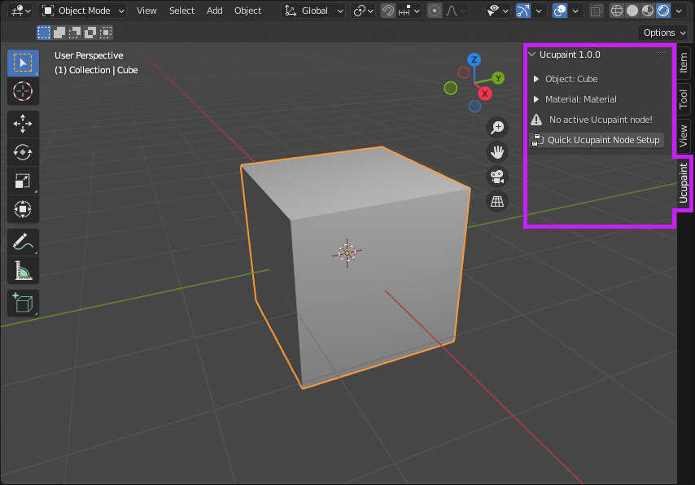

# INTRODUCTION TO UCUPAINT

## What is Ucupaint?

Ucupaint is a Blender addon for managing textures as layers for Eevee and Cycles render engines.

## Requirements

You need at least Blender 2.79 to use this addon, but more advanced features are only available in modern versions of Blender (2.80 & above).

## Installation

- Go to [github.com/ucupumar/ucupaint/releases](https://github.com/ucupumar/ucupaint/releases) and download an addon package according to your Blender version.
- Open Blender, go to Edit > User Preferences, select the Add-ons tab and press the Install button, browse your downloaded addon zip file and click Install add-on.

## Contribute
Visit [Ucupaint Github](https://github.com/ucupumar/ucupaint) to access or contribute to the source code. Or visit [Ucupaint Wiki Github](https://github.com/ucupumar/ucupaint-wiki) to access or contribute to the source code of this wiki.

## Discord Server

You can join [Ucupaint Discord](https://discord.gg/BdNfGGzQHh) to ask or discuss things related to Ucupaint.

## Locations

You can find Ucupaint in the properties panel of the 3D viewport and also the Shader editor. 

### Blender 2.79

For Blender 2.79, you should be using the Cycles render engine.

||
|:--:|
|Ucupaint locations in Blender 2.79 are only available if you're using Cycles| {align=center}

### Blender 2.80 and above

For Blender 2.80 and above, it's in the Ucupaint tab.

||
|:--:|
|Ucupaint location in Blender 2.80 and above| {align=center}
